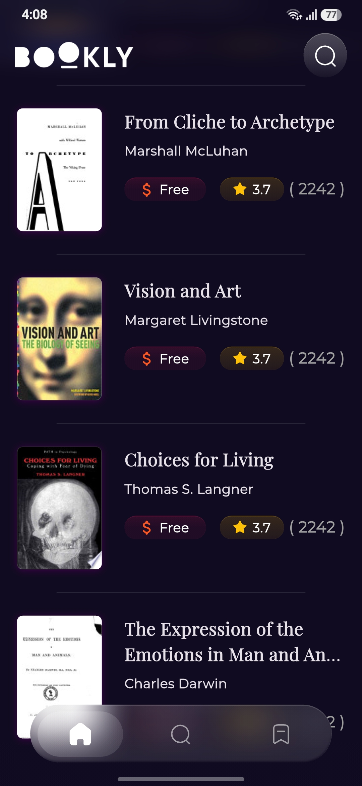
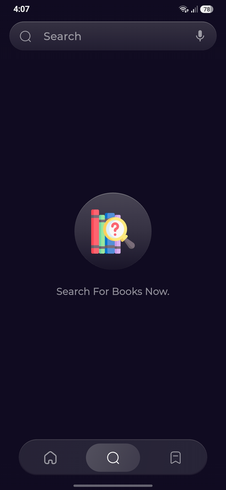
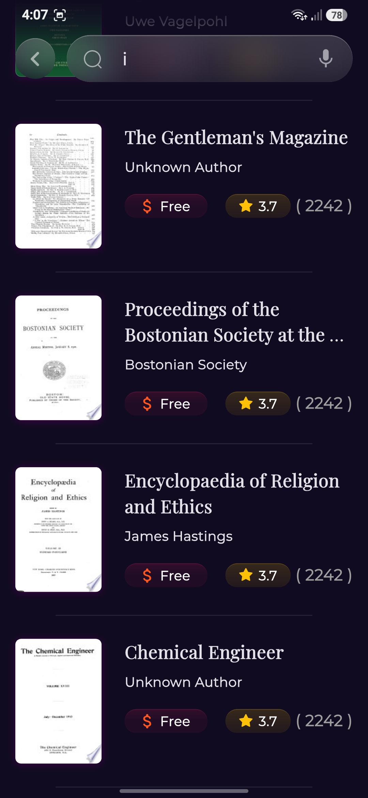
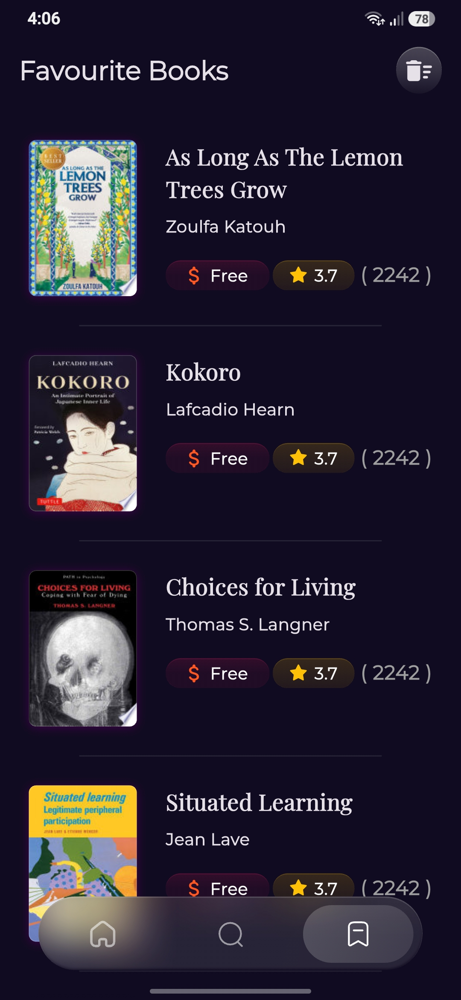
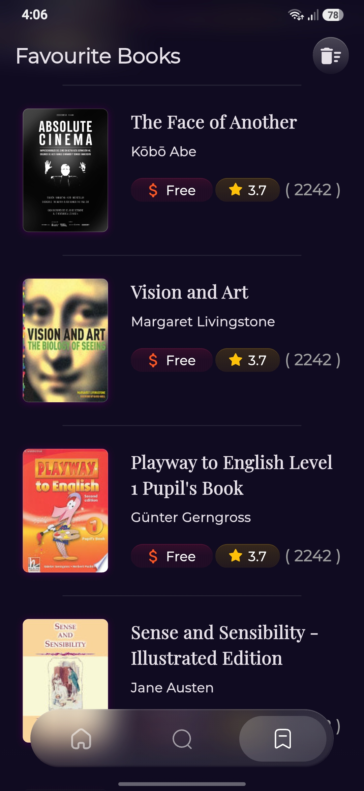
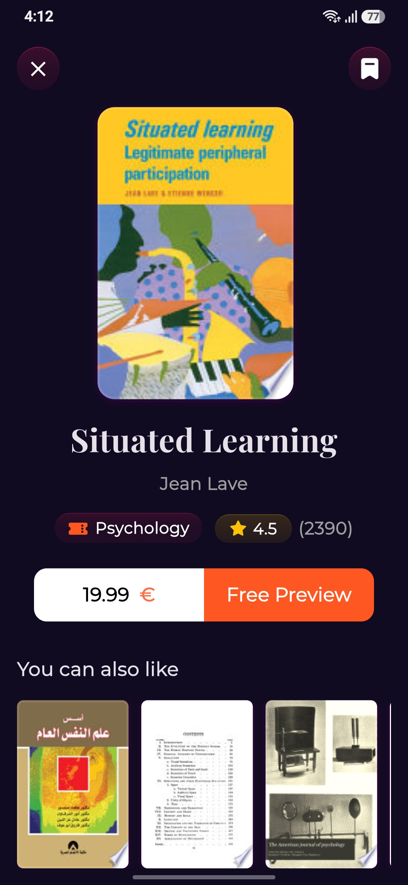
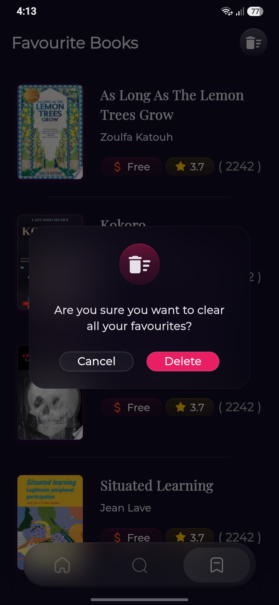
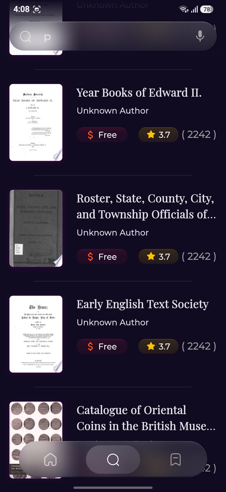

# 📚 Bookly App

A modern Flutter book discovery application that allows users to explore books, view detailed information, and save their favorite books for quick access later.

The app uses the **Google Books API** to fetch book data and follows a clean, scalable architecture to keep the project organized and maintainable.

## ✨ Features

* 📖 Browse featured books
* 🔥 Discover best-selling books
* 🔍 Search for books
* 📚 View detailed book information
* ❤️ Add and remove books from Favorites
* ⭐ Display book ratings and information
* 🌐 Fetch books from Google Books API
* ⚡ Fast and responsive UI
* 📱 Responsive design for different screen sizes
* 💾 Local storage for favorite books

## 🛠️ Technologies & Tools

* **Flutter**
* **Dart**
* **Dio** — API requests
* **Google Books API** — Books data
* **Flutter Bloc / Cubit** — State management
* **Hive** — Local storage
* **Repository Pattern** — Data abstraction
* **MVVM Architecture**
* **Clean Architecture principles**

## 🏗️ Architecture

The project follows a layered architecture using **MVVM + Repository Pattern**.

```text
lib/
│
├── core/
|   ├── helper/
|   ├── models/
│   ├── utils/
│   ├── errors/
│   └── widgets/
│
├── Features/
│   ├── home/
│   │   ├── data/
│   │   │   ├── models/
│   │   │   └── repos/
│   │   │
│   │   ├── presentation/
│   │   │   ├── view/
│   │   │   └── view_model/
│   │
│   ├── search/
|   |
|   ├── Splash/
│   │
│   └── favorites/
│
├── constant.dart
│
└── main.dart
```


This separation makes the application easier to maintain, test, and extend with new features.

## ❤️ Favorites Feature

The app includes a Favorites system that allows users to save books locally.

When the user presses the favorite button:

```text
User taps ❤️
      ↓
Favorites Cubit
      ↓
Favorites Repository
      ↓
Hive Local Storage
      ↓
UI updates
```

Favorite books remain available locally even after restarting the application.

## 🌐 API

Book data is provided by the **Google Books API**.

The application retrieves information such as:

* Book title
* Authors
* Thumbnail
* Description
* Categories
* Rating
* Published date
* Preview information


## 📦 Main Packages

```yaml
flutter_bloc:
dio:
hive:
hive_flutter:
cached_network_image:
equatable:
```

## 🚀 Getting Started

### 1. Clone the repository

```bash
git clone <YOUR_REPOSITORY_URL>
```

### 2. Navigate to the project

```bash
cd bookly_app
```

### 3. Install dependencies

```bash
flutter pub get
```

### 4. Run the application

```bash
flutter run
```

## 🎯 What I Learned

While building this project, I practiced and improved my understanding of:

* MVVM architecture
* Repository Pattern
* Flutter UI development
* REST APIs
* API integration using Dio
* State management with Cubit
* Local data persistence with Hive
* Managing asynchronous operations
* Error handling
* Building reusable Flutter widgets
* Organizing a scalable Flutter project

## 📸 Screenshots

| Home                                                   | Home                                                      |
| ------------------------------------------------------ | --------------------------------------------------------- |
|                    |                      |

| Search                                                 | Search                                                    |
| ------------------------------------------------------ | --------------------------------------------------------- |
|                |                  |

| Favourite                                              | Favourite                                                 |
| ------------------------------------------------------ | --------------------------------------------------------- |
|                |                  |

| Details                                                | Details                                                   |
| ------------------------------------------------------ | --------------------------------------------------------- |
|              |                |

| Confirm Delete                                         | Search                                                    |
| ------------------------------------------------------ | --------------------------------------------------------- |
|        |                     |


## 🔮 Future Improvements

* 🔐 User authentication
* ☁️ Cloud synchronization for favorites
* 📚 Reading list
* 🔔 Book recommendations
* 🌙 Dark mode
* 📊 Reading progress tracking

## 👨‍💻 Author

**Mohamed Taha**

Flutter Developer

* GitHub: <YOUR_GITHUB_LINK>
* LinkedIn: <YOUR_LINKEDIN_LINK>
* Portfolio: <YOUR_PORTFOLIO_LINK>

---

⭐ If you like this project, consider giving it a star!
